📱 Aivora – Android App (Capacitor)

Aivora is a multi-feature Android application created by converting an existing web platform into a mobile app using Capacitor.

This project demonstrates real web → Android conversion, code reuse, and Android deployment using modern tooling.

🚀 Overview

Aivora began as a feature-rich web application and was later extended into an Android app using Capacitor.

Instead of rewriting the app, the same web codebase is wrapped inside a native Android WebView, allowing faster development and easier maintenance.

✅ This is a working Android app, not a UI mockup.

✨ Features

Home dashboard

AI / Chat interface

Navigation bar with multiple sections

User login & profile screens

Roadmap & navigation pages

SOS / utility features

Live map UI

Fully responsive mobile layout

🧩 Use Cases

Utility-based mobile apps

Student-focused platforms

Chat-based applications

Web-to-mobile conversion projects

Capacitor learning projects

🛠 Tech Stack

HTML

CSS

JavaScript

Capacitor

Android WebView

Android Studio

🔄 Conversion Workflow

Built and tested the web application

Initialized Capacitor

Added Android platform

Synced web assets

Generated APK using Android Studio

Installed and tested on a real Android device

📸 Screenshots (Real App Proof)

All screenshots below are real images taken from the running Android app.
They are stored inside the /screenshots folder.

🏠 Home & Dashboard

 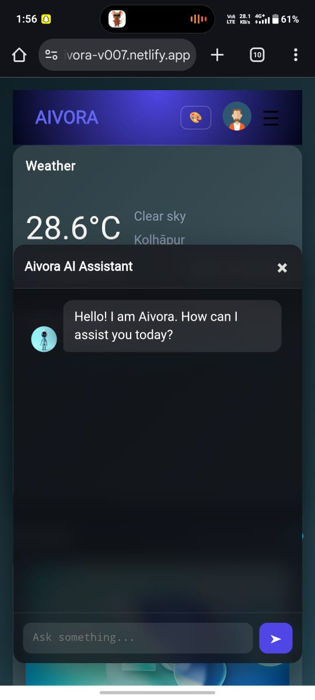 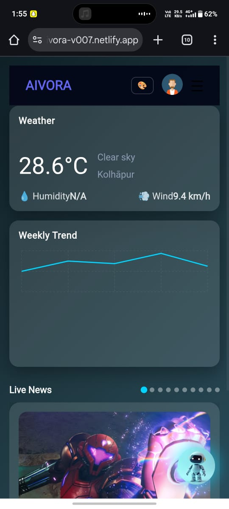 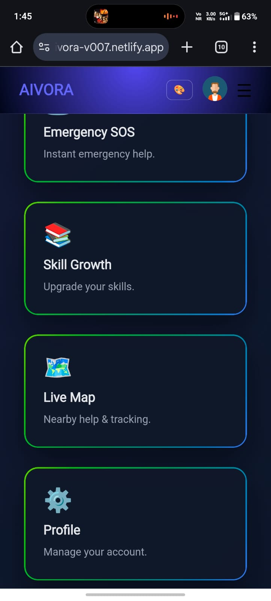 
 
 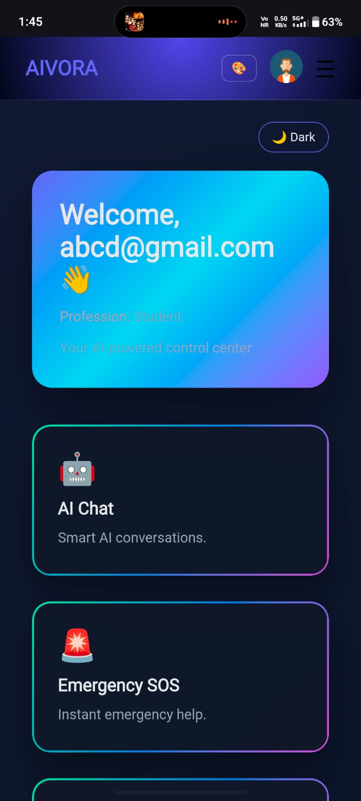 

💬 Chat & Navigation

 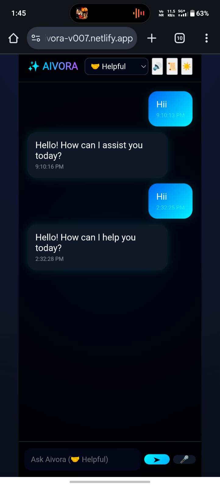 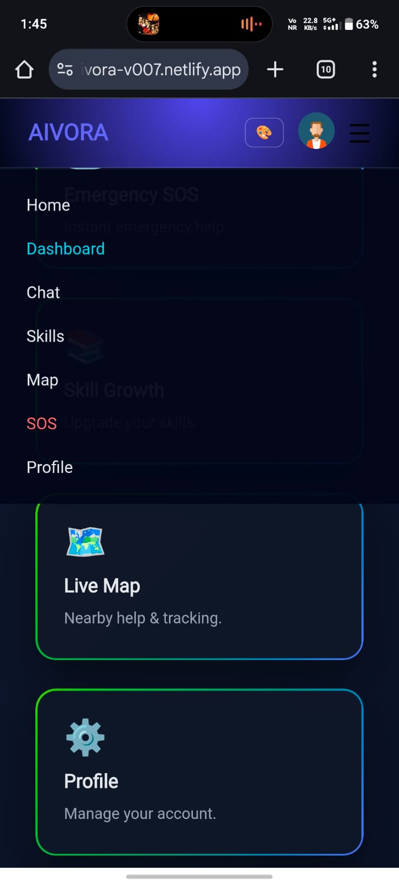 

👤 User & Utility Screens

 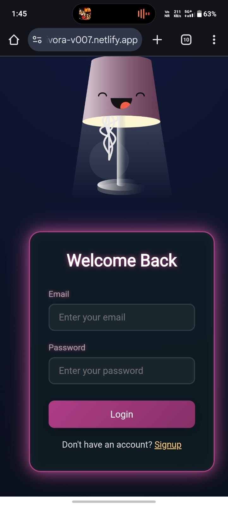 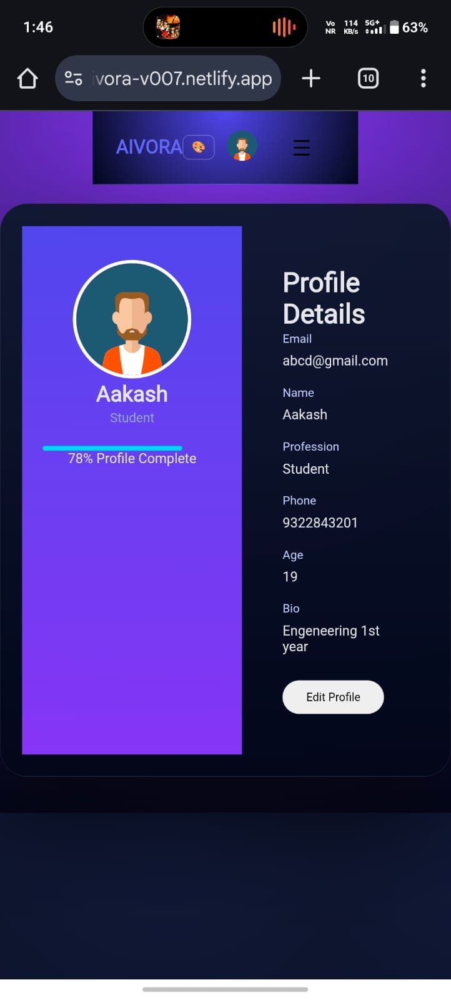 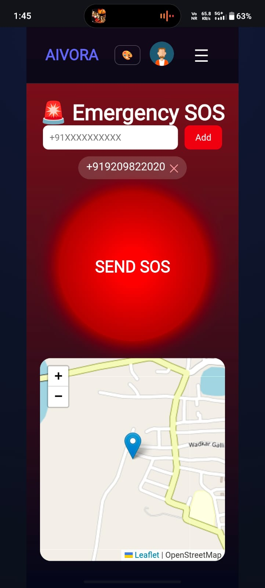 

🗺 Navigation & Live Features

 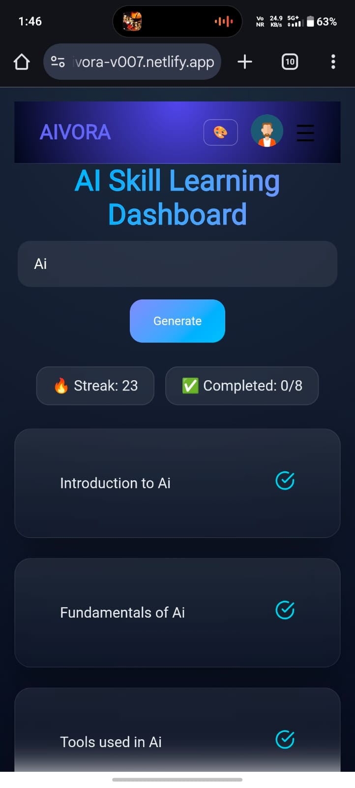 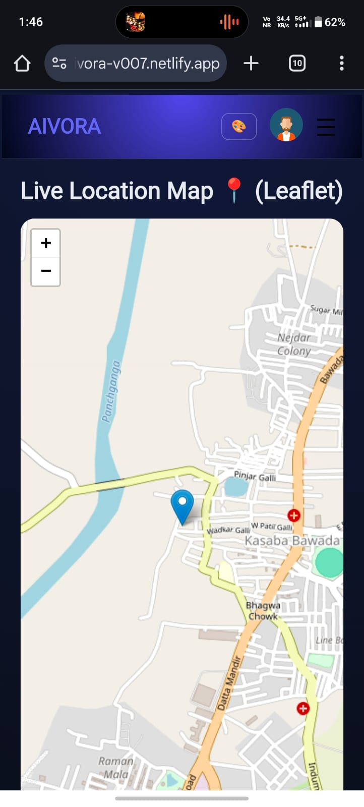 

📦 APK Status

✅ APK generated successfully

✅ Installed on physical Android device

✅ Runs via Capacitor WebView

🔗 Related Project

Web version: Aivora Web App
(The Android app reuses the same core web codebase)

🧠 What This Project Demonstrates

Web-to-Android conversion using Capacitor

Android build & deployment workflow

WebView-based mobile apps

Multi-screen mobile UI

Real project documentation

🔮 Future Improvements

Firebase authentication

Cloud data sync

Push notifications

Performance optimizations

Improved mobile UI/UX

⭐ Support

If you like this project:

⭐ Star the repository

🍴 Fork it

💬 Share feedback

📄 License

MIT License

👤 Author

Shreyash Mane
CSE First-Year Student
Web & App Developer

🔗 GitHub: https://github.com/shreyashmane-dev

🔗 LinkedIn: https://www.linkedin.com/in/shreyash-mane-7675a4385

